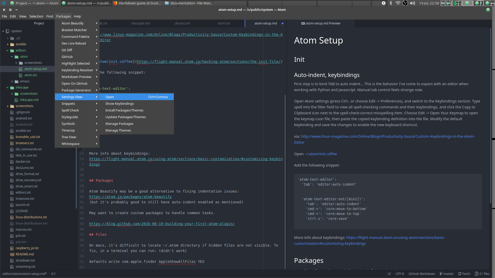
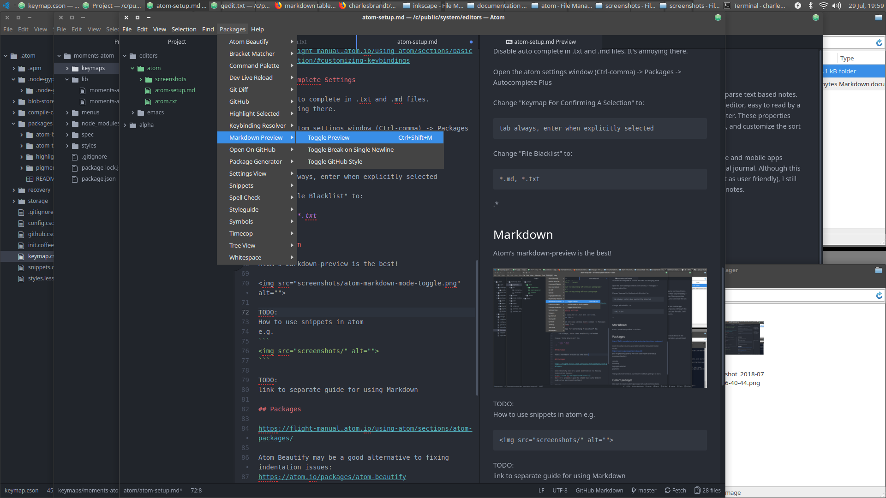

# Atom Setup

## download

https://duckduckgo.com/?q=atom+editor&t=ffab&ia=web
atom editor at DuckDuckGo
https://atom.io/
Atom
https://en.wikipedia.org/wiki/Atom_(text_editor)
Atom (text editor) - Wikipedia
https://atom.io/
Atom


## Init, Settings

New editor windows will open with settings already visible. If you need to re-open them later, it's easiest to use Ctrl-comma or the menu:

Open


Generally, these files are located in your ~/.atom directory. E.g.
[~/.atom/init.coffee](https://flight-manual.atom.io/hacking-atom/sections/the-init-file/)

On macs, it's difficult to locate ~/.atom directory in the file browser if hidden files are not visible. Just use the Ctrl-, -> Settings -> Open Config Folder sequence to open it.

### Auto-indent, keybindings

First step is to bind TAB to auto indent...
This is the behavior I've come to expect with an editor when working with Python and Javascript. Manual tab control feels strange now.

Open Atom settings (press Ctrl-, or choose Edit -> Preferences), and switch to the Keybindings section. Type spell into the filter field to view all spell-checking commands and their keybindings, and click the Copy to Clipboard icon next to the spell-check:correct-misspelling item. Choose Edit -> Open Your Keymap to open the keymap.cson file, then paste the copied keybinding definition into the file. Modify the default keybinding and save the changes to enable the new keyboard shortcut.

via:  
http://www.linux-magazine.com/Online/Blogs/Productivity-Sauce/Custom-Keybindings-in-the-Atom-Editor

Add the following snippet:

```
'atom-text-editor':
  'tab': 'editor:auto-indent'
  # macs default to cmd-s
  'ctrl-s': 'core:save'
  'ctrl-j': 'moments-atom:journal'
  'ctrl-d': 'editor:delete'
  'ctrl-backspace': 'editor:delete-to-beginning-of-word'

  # https://flight-manual.atom.io/using-atom/sections/moving-in-atom/
  # https://github.com/atom/atom/issues/1288
  'cmd->': 'core:move-to-bottom'
  'cmd-<': 'core:move-to-top'
  'ctrl->': 'core:move-to-bottom'
  'ctrl-<': 'core:move-to-top'
  'ctrl-a': 'editor:move-to-beginning-of-line'
  'ctrl-e': 'editor:move-to-end-of-line'
  'ctrl-up': 'editor:move-to-beginning-of-previous-paragraph'
  'ctrl-down': 'editor:move-to-beginning-of-next-paragraph'
  'ctrl-left': 'editor:move-to-beginning-of-word'
  'ctrl-right': 'editor:move-to-end-of-word'
  'shift-ctrl-up': 'editor:select-to-beginning-of-previous-paragraph'
  'shift-ctrl-down': 'editor:select-to-beginning-of-next-paragraph'
  'shift-ctrl-left': 'editor:select-to-beginning-of-word'
  'shift-ctrl-right': 'editor:select-to-end-of-word'

  # what is this for?
  'ctrl-shift-T': 'unset!'

```

More info about keybindings:  
https://flight-manual.atom.io/using-atom/sections/basic-customization/#customizing-keybindings

### Autocomplete Settings

Disable auto complete in .txt and .md files.
It's annoying there.  

Open the atom settings window (Ctrl-comma) -> Packages -> Autocomplete Plus

Change "Keymap For Confirming A Selection" to:

    tab always, enter when explicitly selected

Change "File Blacklist" to:

    *.md, *.txt
.*

https://flight-manual.atom.io/using-atom/sections/autocomplete/


## Markdown

Atom's markdown-preview is the best!



TODO:  
How to use snippets in atom
e.g.  
```

```

TODO:  
link to separate guide for using Markdown

## Packages

https://atom.io/packages/

https://flight-manual.atom.io/using-atom/sections/atom-packages/

Atom Beautify may be a good alternative to fixing indentation issues:  
https://atom.io/packages/atom-beautify  
(but it's probably good to still have auto-indent enabled as mentioned earlier)

https://atom.io/packages/python-indent

https://atom.io/packages/ide-python

highlight-selected  
pigments  

https://atom.io/packages/path-copy  
path-copy  
https://atom.io/packages/tree-view-copy-relative-path

minimap  

zentabs  

Trying out atom-terminal, but haven't had luck getting it to work.


### Custom packages

May want to create custom packages to handle common tasks.

Follow along with the documentation:  
https://flight-manual.atom.io/hacking-atom/sections/package-modifying-text/

https://blog.github.com/2016-08-19-building-your-first-atom-plugin/

```
cd /c/public/moments-atom
apm install .
#Installing modules ✓
```
Open the Command Palette and run the “Window: Reload” command.

#### Publishing

https://flight-manual.atom.io/hacking-atom/sections/publishing/

```
cd path-to-your-package
apm publish minor

```


## TODO:  

Go to Atom > Open Your Config

'editor':
  'softWrap': true

https://discuss.atom.io/t/turn-on-line-wrap/1627/3

"*":
  "autocomplete-plus":
    confirmCompletion: "tab always, enter when suggestion explicitly selected"
    fileBlacklist: [
      ".*"
      "*.md"
      "*.txt"
    ]
  'editor':
    'softWrap': true
  core:
    telemetryConsent: "limited"
  "exception-reporting":
    userId: "8b569cf4-b417-4d01-b980-dfdeee62d676"
  welcome:
    showOnStartup: false
