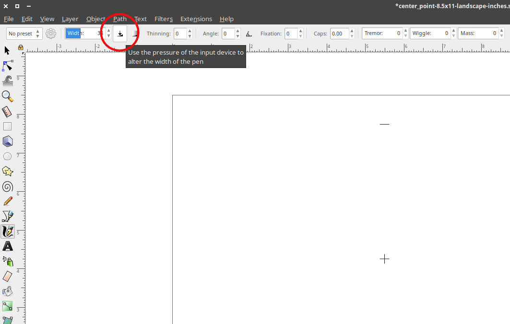

# Inkscape

Add Inskape to favorites in application launcher

Launch inkscape


Exit fullscreen and resize as needed:


Configure best default settings

  - In this order:
    - Ctrl - Shift - O
    - Ctrl - Shift - M
    - Ctrl - Shift - A
    - Ctrl - Shift - F


  - View -> Show/Hide -> Uncheck following:  
    - Commands Bar  
    - Snap Controls Bar  
    - Palette  


- Consider showing arrange settings.  
  Object -> Arrange...

Exit inkscape so defaults take effect.

## Default application for SVG in file system browser

Set inkscape to be the default opener for svg files
Filemanager -> browse to svg -> right click -> open with -> choose another application -> inkscape -> make default

## Default template

Decide on a default template when Inkscape opens...

It's also possible to make a link to the template:

    cd ~/.config/inkscape/templates/
    rm default.svg
    ln -s /c/public/templates/svg/inches/11x8.5/2x2-wide.svg default.svg

Or you can manually copy in a static version. (There may be newer versions available, so be sure to update frequently.)

    cd /c/public/templates/svg/inches/11x8.5/
    cp 2x2-wide.svg ~/.config/inkscape/templates/default.svg


Just start with a blank document, change the canvas size to whatever you want, and then save the document as templates/default.svg in your Inkscape config directory (~/.config/inkscape on Linux). Then restart Inkscape, and it should open with whatever document you just saved as the default template.

via:  
https://graphicdesign.stackexchange.com/questions/5830/inkscape-changing-default-canvas-size

https://duckduckgo.com/?q=inkscape+default+template&t=canonical&ia=qa

## Default fonts

Set better default font size

    Text -> Text and Font...  
    (ctrl-alt-t)  


Also choose where you want to start with template

## Importing SVGs

When importing a layer or two from one SVG to another, be sure to remove any non-visible layers from the SVG file being imported. Even if they are not visible, they will still get added to the file. This can quickly cause bloat in the destination SVG file.

## Versioning

With graphics, it can be useful to keep old iterations around for easy snapshots. Sometimes files can change dramatically based on what layers are visible at the time.

Nevertheless, SVGs lend themselves quite well to using a typical version control system like git. They're based on XML, so they're all text!

## Pen input

A Wacom tablet (e.g. Bamboo) can help with creating strokes with varying width

https://inkscape.org/doc/tutorials/calligraphy/tutorial-calligraphy.html

Use the Caligraphy / Brush tool (Ctrl-F6)

Be sure to enable the option to "use the pressure of the input device"


Fixation set to 0 also makes sure the brush is always perpendicular to the direction of the stroke.

Just play with settings to get the effect you're after.

## Printing

If your printer supports the document size of the svg, Inkscape has no problem printing it.

You can also scale the image to fit on a single page. This can be useful for drafts and physical edits.

If you want to print something larger than a single page, you'll need to split it up outside of Inkscape for printing (as of 2019.06.30).

Trying:

```
Just had to solve this today. I used Inkscape's Print and printed to a PDF file (which is a standard feature on Linux; I don't know about other platforms), and then I used pdfposter to split it into pages:

pdfposter -m a4 -p a3 infile.pdf outfile.pdf

Translation: use A4 pages to build an A3-sized poster.
```

From the pdfposter man page:

```
       -m BOX, --media-size=BOX
              Specify the desired media size to print on.  See below for BOX.
              The default is A4 in the standard package.

       -p BOX, --poster-size=BOX
              Specify the poster size. See below for BOX.  pdfposter will
              autonomously choose scaling and rotation to best fit the input
              onto the poster (see EXAMPLES below).

              If you give neither the -s nor the -p option, the default poster
              size is identical to the media size.
```

    sudo apt-get install pdfposter

This resulted in a slightly off scale... might not be using A4:

    pdfposter -m a4 -p 12x24inch

Trying:

    pdfposter -m 11x8.5inch -p 12x24inch

Still got some down scaling from this setting... maybe:

    pdfposter -m 8.5x11inch -s 1

Still off by 2 inches. Hmmm... TODO.

TODO:
was not able to get the rotation correct. Something to work on in future iterations

Via:
https://www.google.com/search?q=print+svg+on+multiple+pages
https://superuser.com/questions/161313/print-a-huge-svg
https://bugs.launchpad.net/inkscape/+bug/170274


## Arrows

How to create arrows --

Some of these are available on Fill and Stroke settings. After creating a line, open Fill and Stroke settings and choose the Stroke style tab. Adjust endpoints with the "Markers" options.

Screenshot_2019-06-30_08-20-08-markers.png

TODO:
it may be possible to use a custom symbol to represent the arrow heads if the look you want is not available.

## TODO - Convert raster to vector

Path > Trace Bitmap

http://goinkscape.com/how-to-vectorize-in-inkscape/
https://www.google.com/search?q=raster+to+vector+inkscape

## TODO - fonts

add fonts to the system (see also... ???)  
configure a default font as desired

## TODO - default zoom level

Setting the level in the file and then assigning it as the default doesn't seem to fix the issue.
still getting levels at 300%+
hit '1' key to jump to 100%

https://duckduckgo.com/?q=inkscape+default+zoom+level&t=canonical&ia=web
inkscape default zoom level at DuckDuckGo
https://kattekrab.net/inkscape-change-default-document-properties
Inkscape: Change default document properties | kattekrab
http://www.inkscapeforum.com/viewtopic.php?t=7189
Is it possible to set the default zoom for startup? - InkscapeForum.com

## TODO - misc

research default dpi conversion:
https://inkscape.org/en/learn/faq/#dpi_change


## Links

*2016.02.01 18:06:47 raster vector potrace  
https://duckduckgo.com/?q=convert+raster+to+svg&t=canonical  
convert raster to svg at DuckDuckGo  
https://en.wikipedia.org/wiki/Image_tracing  
Image tracing - Wikipedia, the free encyclopedia  
https://en.wikipedia.org/wiki/Potrace  
Potrace - Wikipedia, the free encyclopedia  


*2014.05.07 18:49:09  
was curious what the tweak tool does...  
interesting...  
like a smudge tool for vector  

http://tavmjong.free.fr/INKSCAPE/MANUAL/html/Tweak.html  
