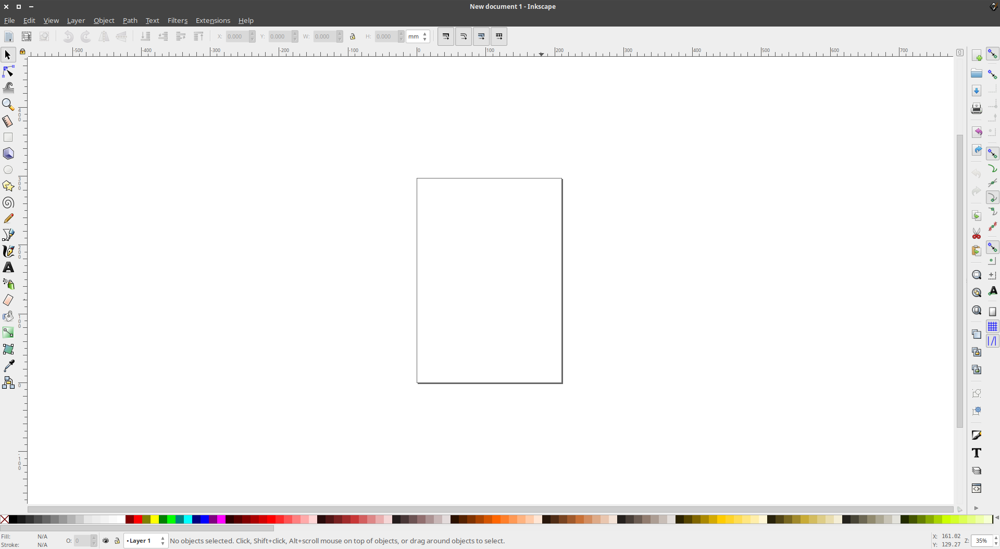
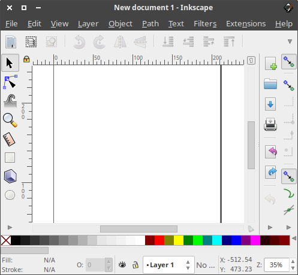

# Inkscape

Add Inskape to favorites

launch inkscape

Exit fullscreen and resize as needed:

Configure best default settings

  - In this order:
    - Ctrl - Shift - O
    - Ctrl - Shift - M
    - Ctrl - Shift - A
    - Ctrl - Shift - F

  - View -> Show/Hide -> Uncheck following:  
    - Commands Bar  
    - Snap Controls Bar  
    - Palette  

- Consider showing arrange settings.  
  Object -> Arrange...

Exit inkscape so defaults take effect.

## Filesystem browser

Set inkscape to be the default opener for svg files
Filemanager -> browse to svg -> right click -> open with -> choose another application -> inkscape -> make default

## TODO

add fonts to the system (see also... ???)
configure a default font as desired

decide on a default template when it opens...

    cd /c/public/templates/svg/pixels
    cp 1920x1080-desktop-017.svg ~/.config/inkscape/templates/default.svg

 Just start with a blank document, change the canvas size to whatever you want, and then save the document as templates/default.svg in your Inkscape config directory (~/.config/inkscape on Linux). Then restart Inkscape, and it should open with whatever document you just saved as the default template.

via:
https://graphicdesign.stackexchange.com/questions/5830/inkscape-changing-default-canvas-size

https://duckduckgo.com/?q=inkscape+default+template&t=canonical&ia=qa

