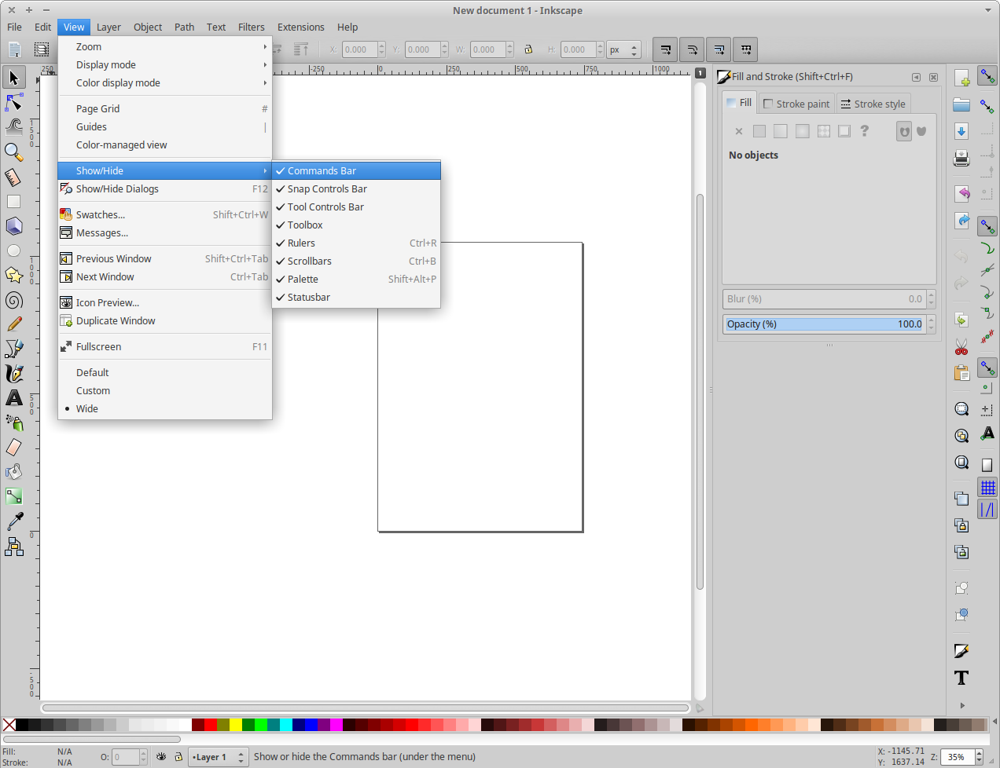

# Inkscape

## TODO
vue based svg editor

Add Inskape to favorites

Launch inkscape

Exit fullscreen and resize as needed:

Configure best default settings

  - In this order:
    - Ctrl - Shift - O
    - Ctrl - Shift - M
    - Ctrl - Shift - A
    - Ctrl - Shift - F

  - View -> Show/Hide -> Uncheck following:  
    - Commands Bar  
    - Snap Controls Bar  
    - Palette  

- Consider showing arrange settings.  
  Object -> Arrange...

Exit inkscape so defaults take effect.

## Default application for SVG in filesystem browser

Set inkscape to be the default opener for svg files
Filemanager -> browse to svg -> right click -> open with -> choose another application -> inkscape -> make default

## Default template

Decide on a default template when Inkscape opens...

TODO: This is not the best one. Something 11x8.5 would be better. Does this also affect default zoom levels?

    # there may be newer versions available
    # update frequently
    cd /c/public/templates/svg/inches/11x8.5/
    cp 2x2-wide- tab ~/.config/inkscape/templates/default.svg

Just start with a blank document, change the canvas size to whatever you want, and then save the document as templates/default.svg in your Inkscape config directory (~/.config/inkscape on Linux). Then restart Inkscape, and it should open with whatever document you just saved as the default template.

via:  
https://graphicdesign.stackexchange.com/questions/5830/inkscape-changing-default-canvas-size

https://duckduckgo.com/?q=inkscape+default+template&t=canonical&ia=qa

## Default fonts

Set better default font size

    Text -> Text and Font...  
    (ctrl-alt-t)  

Also choose where you want to start with template

## Importing SVGs

When importing a layer or two from one SVG to another, be sure to remove any non-visible layers from the SVG file being imported. Even if they are not visible, they will still get added to the file. This can quickly cause bloat in the destination SVG file. 

## Pen input

A Wacom tablet (e.g. Bamboo) can help with creating strokes with varying width

https://inkscape.org/doc/tutorials/calligraphy/tutorial-calligraphy.html

Use the Caligraphy / Brush tool (Ctrl-F6)

Be sure to enable the option to "use the pressure of the input device"

Fixation set to 0 also makes sure the brush is always perpendicular to the direction of the stroke.

Just play with settings to get the effect you're after.

## TODO - Convert raster to vector

Path > Trace Bitmap

http://goinkscape.com/how-to-vectorize-in-inkscape/
https://www.google.com/search?q=raster+to+vector+inkscape

## TODO - default zoom level

Setting the level in the file and then assigning it as the default doesn't seem to fix the issue.
still getting levels at 300%+
hit '1' key to jump to 100%

https://duckduckgo.com/?q=inkscape+default+zoom+level&t=canonical&ia=web
inkscape default zoom level at DuckDuckGo
https://kattekrab.net/inkscape-change-default-document-properties
Inkscape: Change default document properties | kattekrab
http://www.inkscapeforum.com/viewtopic.php?t=7189
Is it possible to set the default zoom for startup? - InkscapeForum.com

## TODO - fonts

add fonts to the system (see also... ???)  
configure a default font as desired

## TODO - misc

research default dpi conversion:
https://inkscape.org/en/learn/faq/#dpi_change

How to create arrows? [2018.09.15 05:50:22]

## Links

*2016.02.01 18:06:47 raster vector potrace  
https://duckduckgo.com/?q=convert+raster+to+svg&t=canonical  
convert raster to svg at DuckDuckGo  
https://en.wikipedia.org/wiki/Image_tracing  
Image tracing - Wikipedia, the free encyclopedia  
https://en.wikipedia.org/wiki/Potrace  
Potrace - Wikipedia, the free encyclopedia  

*2014.05.07 18:49:09  
was curious what the tweak tool does...  
interesting...  
like a smudge tool for vector  

http://tavmjong.free.fr/INKSCAPE/MANUAL/html/Tweak.html  
