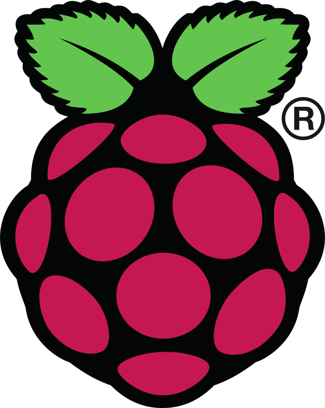

# Raspberry Pi

Need a computer?
This is a great place to start. 

## Getting started

- Choose your hardware
- Choose your operating system
- Choose any services

## Hardware

There are many types of Pi computers. Choose the one that best fits your project's use case. At a minimum you'll need:

  - Raspberry Pi Computer
  - Power Supply
  - Memory Card

I also often like a power switch if the device will not be powered on all of the time. 

TODO: hardware lists and references

### Power

[power supplies](hardware/power-supply.md)  

In addition to a good power supply
it's important to make sure you have a good powered usb hub before attempting to connect peripherals. Even a wired usb keyboard and mouse can be too much for a pi zero, I've found. 

### Storage 

A server should have more memory available.  

32GB is good for a server installation.  

64GB is good to use for a camera installation. (TODO: confirm pi zero can create a file system that big. Should work).  

## Operating System

[OS Selection & Installation](./os/index.md)  

Once you've got your system install, it's time to configure what the system runs: [Ubuntu](../system/linux/ubuntu.md)

## Projects Using Pi

### Camera

[Camera](./hardware/camera.md)

### Time clock

aka a Digital Time Keeping System

https://city-of-bloomington.github.io/timetrack/  
TimeTrack Raspberry Pi | timetrack  

https://github.com/City-of-Bloomington/timetrack  
City-of-Bloomington/timetrack: Digital time keeping system with both a web-based calendar entry and a kiosk based badge entry interface  

### Media server

Run docker to allow multiple services on the same server.  

Docker image for plex somewhere? 

https://docs.linuxserver.io/images/docker-plex

## Hardware Details

[troubleshooting](troubleshooting.md)  
[GPIO](./hardware/gpio.md)  

