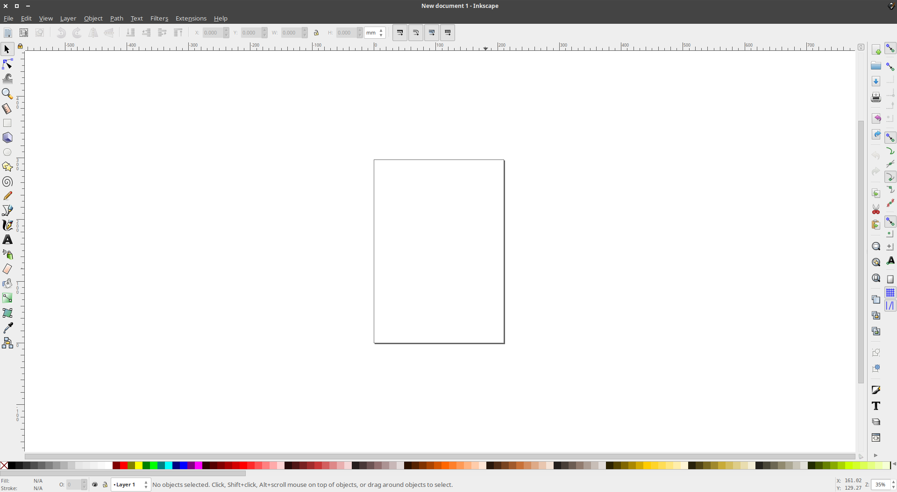
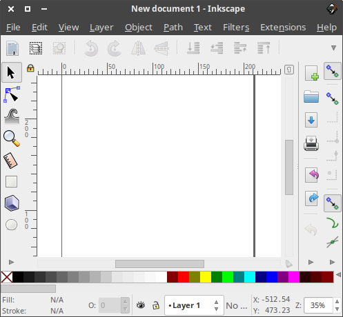
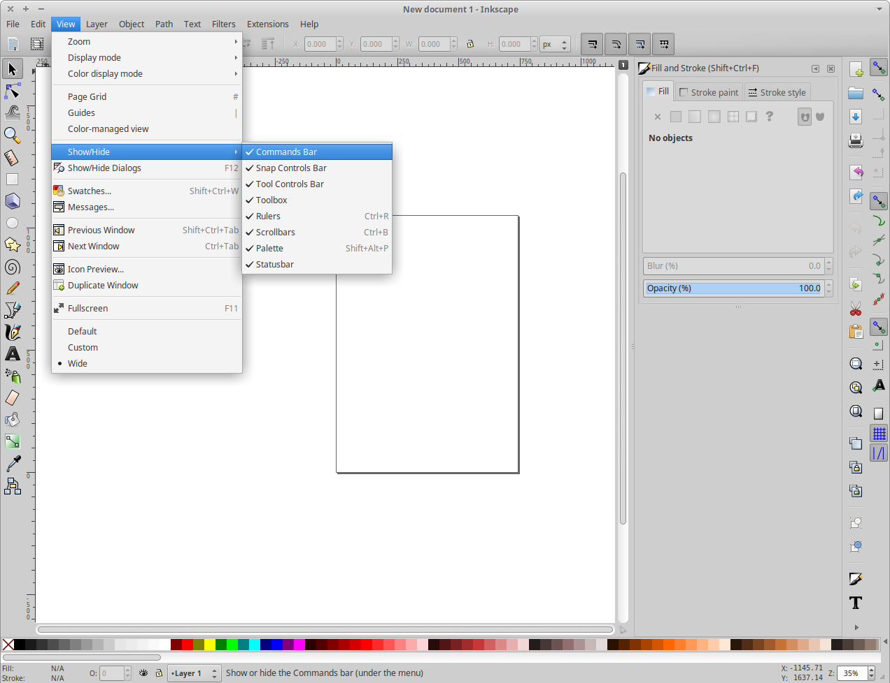

# Inkscape

sudo apt-get install inkscape

Add Inskape to favorites in application launcher

Launch Inkscape



Exit fullscreen and resize as needed:



Configure best default settings

  - In this order:
    - Ctrl - Shift - O
    - Ctrl - Shift - M
    - Ctrl - Shift - A
    - Ctrl - Shift - F
    - Ctrl - Shift - L


  - View -> Show/Hide -> Uncheck following:  
    - Commands Bar  
    - Palette  



- Consider showing arrange settings.  
  Object -> Arrange...

Exit inkscape so defaults take effect.


## Default application for SVG in file system browser

Set inkscape to be the default opener for svg files
Filemanager -> browse to svg -> right click -> open with -> choose another application -> inkscape -> make default


## Default template

Decide on a default template when Inkscape opens...  
Make a link to the template:

```
cd ~/.config/inkscape/templates/
rm default.svg
ln -s ~/templates/template.svg default.svg
```

Alternatively, manually copy in a static version. There may be newer versions available, so be sure to update frequently.

```
cp ~/templates/template.svg ~/.config/inkscape/templates/default.svg
```

No template available? Start with a blank document, change the canvas size to whatever you want, and then save the document as templates/default.svg in your Inkscape config directory (~/.config/inkscape on Linux). Then restart Inkscape, and it should open with whatever document you just saved as the default template.

via:  
https://graphicdesign.stackexchange.com/questions/5830/inkscape-changing-default-canvas-size

https://duckduckgo.com/?q=inkscape+default+template&t=canonical&ia=qa


## Default fonts

Set better default font size

    Text -> Text and Font...  
    (ctrl-alt-t)  


Also choose where you want to start with template


## Importing SVGs

When importing a layer or two from one SVG to another, be sure to remove any non-visible layers from the SVG file being imported. Even if they are not visible, they will still get added to the file. This can quickly cause bloat in the destination SVG file.


## Versioning

With graphics, it can be useful to keep old iterations around for easy snapshots. Sometimes files can change dramatically based on what layers are visible at the time.

Nevertheless, SVGs lend themselves quite well to using a typical version control system like git. They're based on XML, so they're all text!


## Pen input

A Wacom tablet (e.g. Bamboo) can help with creating strokes with varying width

https://inkscape.org/doc/tutorials/calligraphy/tutorial-calligraphy.html

Use the Caligraphy / Brush tool (Ctrl-F6)

Be sure to enable the option to "use the pressure of the input device"


Fixation set to 0 also makes sure the brush is always perpendicular to the direction of the stroke.

Just play with settings to get the effect you're after.


## Printing

If your printer supports the document size of the svg, Inkscape has no problem printing it.

You can also scale the image to fit on a single page. This can be useful for drafts and physical edits.


## Tools

### Tweak
was curious what the tweak tool does...  
interesting...  
like a smudge tool for vector  

http://tavmjong.free.fr/INKSCAPE/MANUAL/html/Tweak.html  

